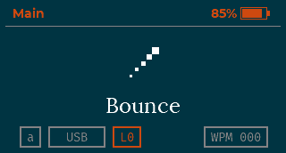
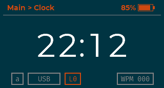
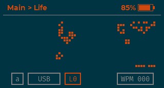
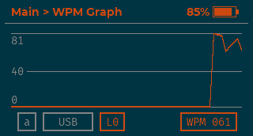
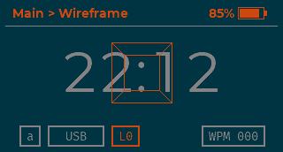
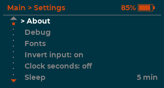

# meletricks

A custom firmware tweak for the LCD on some Meletrix keyboards.  
Includes some animated demos, WPM tracking, and customizable UI.


The tweak does not permanently replace the original firmware. It's loaded in memory and runs until the LCD module is power cycled.

<p align="center">
  
  &nbsp;
  
  <br/>
  
  &nbsp;
  
  <br/>
  
  &nbsp;
  
</p>

---

## Supported boards

| Board key       | Hardware                |
|-----------------|-------------------------|
| `zoomtkldyna`   | Zoom TKL Dyna           |
| `zoom75tiga`    | Zoom75 TIGA             |

More boards that use the same LCD module can be easily added by extracting a few firmware offsets.  
Each board's definitions are in a header file at `sdk/boards/<board>/board.h`


[Adding a board](#adding-a-board).

---

## Quick start

### Toolchain

macOS:
```sh
# ARM cross-compiler
brew install arm-none-eabi-gcc           # macOS

# Loader dependencies
pip install -r tools/TweakLoader/requirements.txt
brew install keystone
```

### Build

```sh
make                           # builds every board
make BOARD=zoomtkldyna         # builds just one
```

Binaries land in `build/<board>/`.

### Upload

```sh
make BOARD=zoomtkldyna upload
make BOARD=zoomtkldyna upload DEVICE_FILTER="my kbd"          # name filter
make BOARD=zoomtkldyna upload DEVICE=AA:BB:CC:DD:EE:FF        # skip scan
```

Power-cycle the keyboard to revert to stock.

### Try without hardware

The repo ships with an emulator

```sh
make emu
```

---

## How the SDK works

### The injection point

`tools/TweakLoader/tweakloader.py` connects over BLE, uploads the
relocated ELF into RAM, and patches a single instruction in the
firmware's tick handler to branch into our trampoline. The stolen
instruction is preserved and replayed before returning, so the stock
firmware keeps running underneath.

The patch site differs per board, so each `board.h` exports it as
`FW_TICK_HOOK`. The firmware C side promotes the macro to a global
linker symbol (`fw_tick_hook`) which tweakloader reads from the ELF
symtab — there's no per-board configuration in the loader.

### Tasks and setup

User code is structured as one (or a few) cooperative tasks plus an
optional setup:

```c
#include "entry.h"

FR_SETUP void boot(void) {
    /* one-time init — runs before any tick */
}

FR_TASK(my_loop, 4096) {
    /* runs every firmware tick. may call fr_yield(). */
}
```

The SDK reserves a private stack per task (size in bytes is the second
arg), and `fr_yield()` suspends just the calling task — others still
run on the same tick.

### Firmware bridge — `firmware.h`

A thin board-agnostic API over the stock firmware's internals:

- `m_draw_frame(fb)` — push a 320×172 RGB565 buffer to the LCD via DMA
- `lcd_is_idle()` / `lcd_wait_idle()` — gate against the DMA
- `lcd_te_sync_{enable,disable}()` — VSYNC busy-wait toggle
- `lcd_sleep()` / `lcd_wake()` — display off/on
- `gui_pause()` / `gui_resume()` — silence the stock GUI task so its
  periodic redraws don't fight us
- `lcd_rtc_get_live(out)` — broken-down current time from the
  firmware's free-running RTC
- `fw_rtc_set(packed)` — set the RTC; tweakloader calls this on
  upload so the clock is correct

### Keyboard events — `kbd_event.h`

The SDK hijacks UART0 to parse the keyboard MCU's wire protocol and
emits two event types into a ring buffer:

```c
kbd_event_t ev;
while (kbd_event_pop(&ev)) {
    if (ev.type == KBD_EV_KEY) {
        /* ev.code = HID scancode (0 = "no key" frame) */
    } else if (ev.type == KBD_EV_LCD) {
        /* ev.code = KBD_LCD_{UP,DOWN,ENTER,BACK} */
    }
}
```

Status snapshots (battery, conn type, caps, layer, OS, win-lock) are
available via `kbd_battery_get` / `kbd_status_get` with optional
`*_set_callback` push hooks for repaint-on-change.

Held keys autorepeat on the wire; release is silence. Consumers
needing one-shots debounce on `(type, code, time_ms)`.

### Timers — `timer.h`

- `fr_micros()` / `fr_millis()` — free-running counters (u32 wrap)
- `fr_delay_us(n)` — yield-friendly delay (other tasks still run)
- `fr_sleep_us(n)` — busy-wait, use sparingly — long sleeps trip the
  firmware watchdog

### ROM syscalls — `fr8000.h`

The fr8000 ROM lives at `0x0000_0000`. Verified syscall signatures
live in `fr8000.h` and resolve through `sdk/fr8000_syscalls.ld` at
link time. To use one not listed there, declare it locally with
`FR_SYSCALL` and promote it once you've sanity-checked the signature.


### Adding a board

1. Find your board's firmware addresses. The `FW_*` macro list in any
   existing `board.h` is the menu — you need every one of them, plus
   `FW_TICK_HOOK` (the tick handler patch site). Ghidra/IDA on a dump
   of the stock firmware is the usual path.
2. Create `sdk/boards/<your-board>/board.h` mirroring the existing
   layouts.
3. `make BOARD=<your-board> upload` and you're done. If you'd like
   your board upstreamed, please contact me or open a PR.

The `make` build-everything target picks up new boards automatically.

---

## Repository layout

```
app/            user app: screens, app widgets, settings, WPM, text log
src/            graphics library + reusable widgets
include/        public headers for the gfx library
fonts/          bitmap fonts (Lora, Fira Mono, Montserrat, …)
sdk/
    include/    SDK public headers (firmware.h, kbd_event.h, …)
    src/        SDK runtime (task dispatch, kbd UART hijack, …)
    boards/     per-board FW address tables
    fr8000.ld, fr8000_syscalls.ld   linker scripts
tools/
    emu/        host emulator (Unicorn + pygame) and UI tester
    TweakLoader BLE upload + symbol-aware ELF relocator
```

---

## How the UI works

### Graphics — `include/gfx*.h` and `include/widgets/`

A retained-mode widget tree organised around screens:

```c
GfxScreen my_screen = {
    .name = "Main",
    .slots = (GfxWidgetSlot[]){
        { menu_widget, MENU_SLOT },
        { s_navbar,    NAVBAR_SLOT },
    },
    .slot_count = 2,
    .clear_color = GFX_BLACK,
};

GfxNavTo(&my_screen);
```

`GfxTick()` (called from a task) ticks each widget, redraws the dirty
ones into its slot, and presents the framebuffer via `m_draw_frame`.
Built-in widgets: `Border`, `Breadcrumb`, `Carousel`, `Clock`, `Graph`,
`Marquee`, `MenuList`, `Progress`, `TextBox`. Each has a
`NewGfx<Name>(...)` designated-init constructor (see
`include/widgets/`).

---

## Tooling

- **TweakLoader** (`tools/TweakLoader/tweakloader.py`) — CLI + tiny
  Tkinter GUI. Scans for keyboards, relocates the ELF, installs the
  tick hook, and zeroes BSS on the device. Auto-detects the patch
  site via the ELF's `fw_tick_hook` symbol; override with `--hook`.
- **Emulator** (`tools/emu/emu.py`) — runs the same ELF on the host in
  Unicorn with every SDK call trapped to a Python handler. `F1`–`F8`
  toggle live status state (caps, conn, OS, battery, …); arrow keys
  and Enter/Backspace drive LCD navigation; letters feed the typing
  log and WPM.
- **UI tester** (`tools/emu/uitest.py`, `make ui-test`) — headless
  tour that walks every screen and dumps PNGs into `screenshots/`.

---

## AI disclaimer

- Most of the graphics library code has been developed using AI.  
- Some parts of the SDK have been developed using AI.  
- Emulator, UI tests and TweakLoader have been fully generated by AI.

## License

GPL-2.0 — see [LICENSE](LICENSE).
